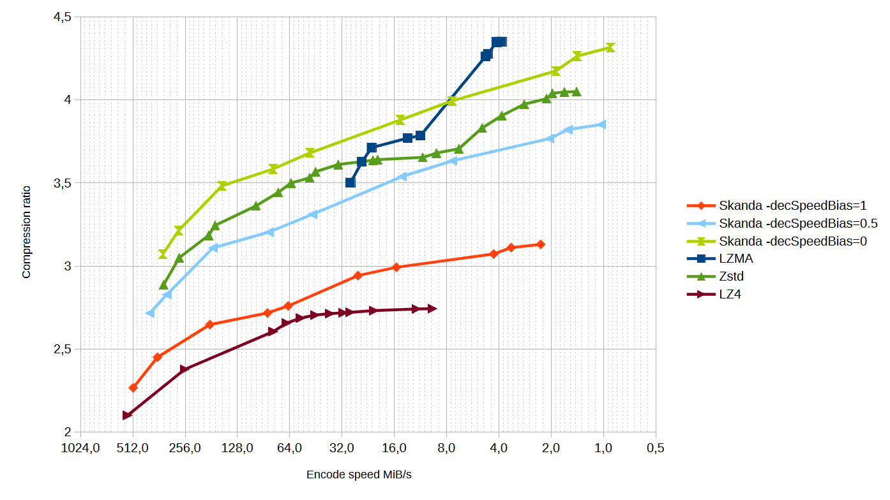
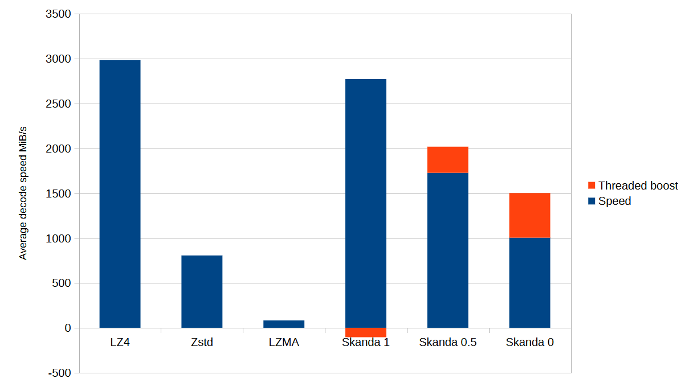

# Skanda

Skanda is an LZ+Huffman based compression algorithm, kinda like an spiritual successor to [Lizard](https://github.com/inikep/lizard). 
Unlike other open-source compressors, which always have a constant decompression speed, Skanda can be fine tuned at runtime to prefer 
better ratios or a higher decoding throughput, while always maintaining encoding and decoding performance that matches or exceeds the 
competition. The only other compressor I know that is capable of this is Oodle by RAD Game Tools, but that is closed source.

# How to use

Simply add the file Skanda.h to your project and create a .cpp file with the following:
```cpp
#define SKANDA_IMPLEMENTATION
#include "Skanda.h"
```
Then simply add the header file anywhere you need.

The API is very simple and straightforward. To compress you might do something like this:
```cpp
uint8_t* outputBuf = new uint8_t[skanda::compress_bound(inputSize)];
size_t compressedSize = skanda::compress(inputBuf, inputSize, outputBuf);
if (skanda::is_error(compressedSize))
  std::cout << "Error while compressing data";
```
And to decompress:
```cpp
size_t err = skanda::decompress(compressedBuf, compressedSize, decompressedBuf, uncompressedSize);
if (skanda::is_error(err))
  std::cout << "Error while decompressing data";
```

During decoding it is possible to use 2 threads on a single compressed file.
You can directly use the ThreadCallback class, which spawns a new thread, or create a custom child class from it
that uses a thread pool. For example:
```cpp
dp::thread_pool threadPool(16);

class MyThreadCallback : public skanda::ThreadCallback {
public:
    std::future<size_t> enqueue(size_t(*func)(void*), void* arg) {
        return threadPool.enqueue(func, arg);
    }
};

int main() {
  //...
  MyThreadCallback threadCallback();
  size_t err = skanda::decompress(compressedBuf, compressedSize, decompressedBuf, uncompressedSize, &threadCallback);
  //...
}
```
This works by decoding the file like a CPU pipeline. Note that it only provides a boost for relatively large files (512+ KiB)
and that were compressed with a decSpeedBias lower than 1 (the lower the bias the bigger the boost).

If you want to keep track of the progress, you can create a child class from ProgressCallbacks, and then pass a pointer of the object to the functions:
```cpp
class MyProgressCallback : public skanda::ProgressCallback {
  size_t fileSize;
  
public:
  MyProgressCallback(size_t _fileSize) {
    fileSize = _fileSize;
  }
  bool progress(size_t bytes) {
    std::cout << "Current progress: " << bytes << "/" << fileSize << "\n";
    return false;
  }
}

int main() {
  //...
  MyProgressCallback progressCallback(inputSize);
  size_t compressedSize = skanda::compress(input, inputSize, output, level, speedBias, &progressCallback);
  //...
}
```

# Benchmarks

The algorithm was benchmarked on Windows 11, on a Ryzen 6900HX@3.3GHz and compiled with Visual Studio 2022. 
The file used was produced by tarring the [Silesia corpus](http://sun.aei.polsl.pl/~sdeor/index.php?page=silesia).





